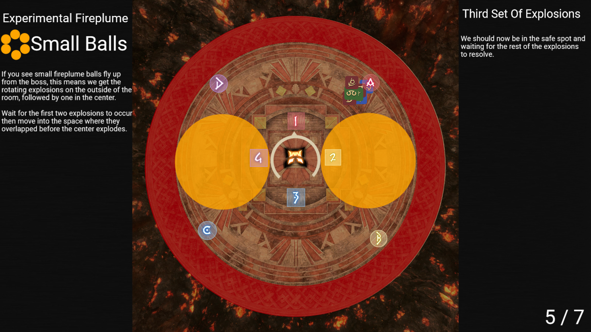

# Pandæmonium Asphodelos: The Third Circle (Savage)

## Experimental Fireplume
[Raid Plan Link](https://raidplan.io/plan/q9cEUVuj28if1R7b)
When experimental fireplume is being cast, all players, including the main tank, should stack in teh center of the arena.

This is because there are two variances that can occur for this mechanic; Large Fireplume or Small Fireplumes.

### Large Fireplume
The large fireplume is denoted by a single large ball of fire flying up from the boss.  This means that **one player is targeted for fireplume to drop on**.  

The AoE from the fireplume drop is massive, and the player targeted is random. This is why we stack in the middle. Doing this, we can bait the fireplume to drop in the center of the arena, and the outside edges of the arena will be safe.

### Small Fireplumes
The small fireplumes are denoted by several small fireballs rotating around the boss before flying up.  This means we're going to get rotating explosions around the room, followed by a final explosion in the center of the room.

Wait for the first two explosions to occur, then move into the space toward where they overlap.

