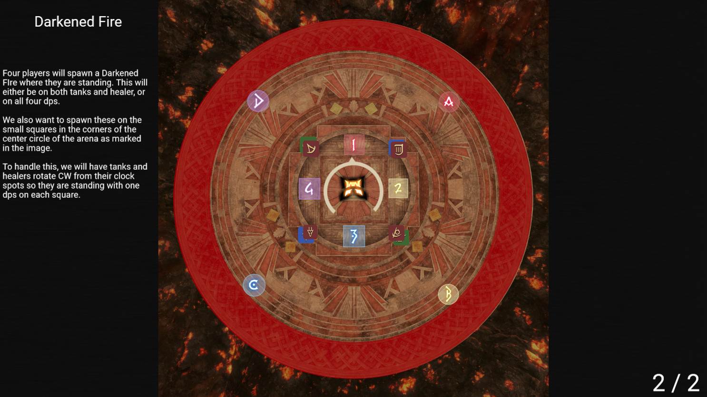
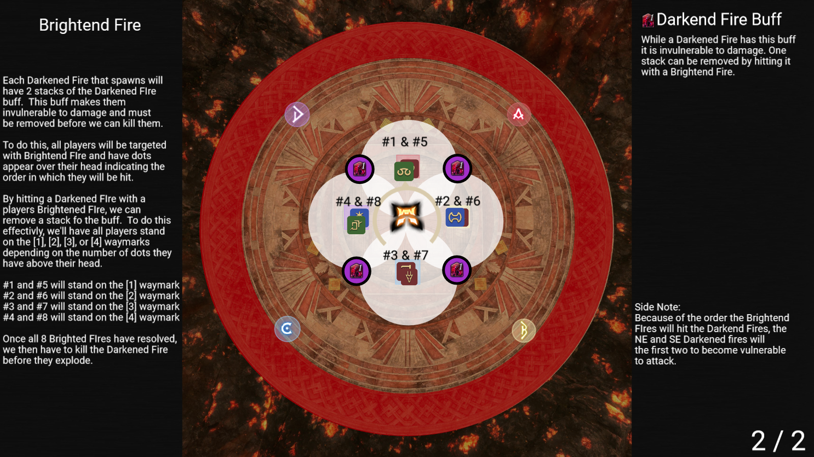

# Pandæmonium Asphodelos: The Third Circle (Savage)

## Darkened Fire + Brightened Fire
[Raid Plan Link](https://raidplan.io/plan/RZ_30a5n9rz-So4M)
This is a two part mechanic that requires the party to drop darkened fire spawns at a specific locations, then hit each of the spawns with a brightened fire in order to remove their debuffs so they can be damaged.

### Darkened Fire
The first part of this mechanic is Darkened Fire.  The boss will target four players and drop a Darkened Fire spawn directly underneath them.  Those four players will either be the tanks and healers, or all four dps.  The Darkened Fire spawns must also be spaced an appropriate distance apart or they will tether together and explode, causing a full party wipe.

To handle this, all DPS should be standing on the square that matches their clock spot.  All tanks and healers will rotate clockwise to stand with a DPS.

### Brightened Fire
The second part of this mechanic is Brightened Fire.  All players will targeted for Brightened FIre as denoted by the white AoE circle targeting them.  Along with this, players will be marked by numbered dots above their head from 1 to 8.

Each Darkened Fire that spawned previous has 4 stacks of the Darkened Fire buff that must be removed in order for us to kill them. To remove 1 stack of a debuff, they must be hit by a Brightened Fire.

To handle, this, we'll have people stand on the 1, 2, 3, and 4 waymarks based on the number of dots over their head.

#1 and #5 will stand on the 1 waymark
#2 and #6 will stand on the 2 waymark
#3 and #7 will stand on the 3 waymark
#4 and #8 will stand on the 4 waymark.

Once all 8 Brightened Fire have resolved, the Darkened Fire spawns must be killed quickly before they enrage and explode. 

