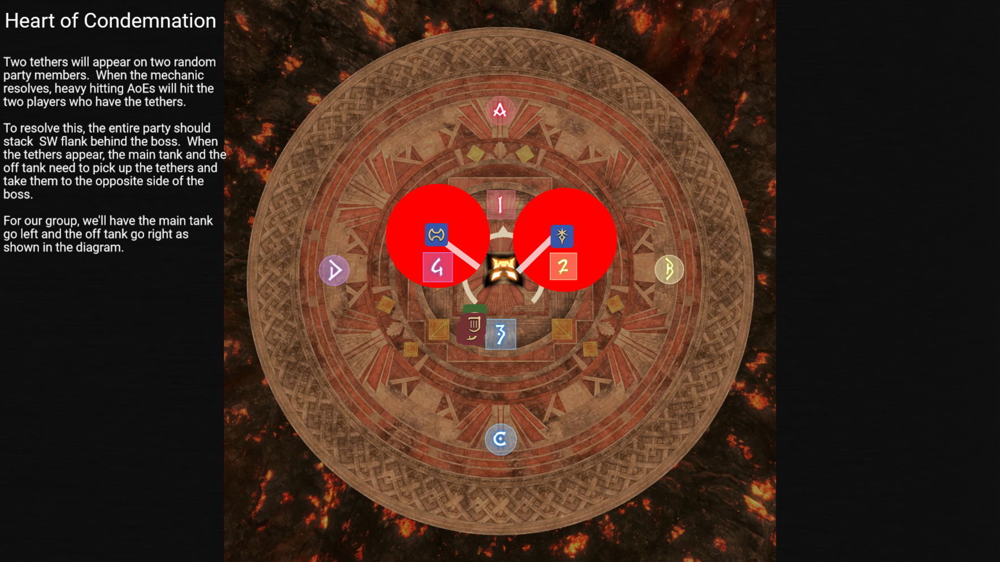

# Pandæmonium Asphodelos: The Third Circle (Savage)

## Heart of Condemnation #2
[Raid Plan Link](https://raidplan.io/plan/E_GO5teZrVykMS-e)
Two tethers will appear on two random party members.  When the mechanic resolves, heaving hitting AoEs will hit the two players who have the teathers.

This is the second heart of condemnation, which comes immediatly after [Darkened + Brightened Fire](./04-darkened-brightened-fire.md).  We will handle this one the same way we handle the first one.  The party will stack on the **South West** flank behind the boss. Both tanks will then move in to grab a tether and take them to opposite sides of the boss.

The **Main Tank** will go left and the **Off Tank** will go right. 

The party needs to ensure they are standing still and not moving around until the tanks have the tethers.

