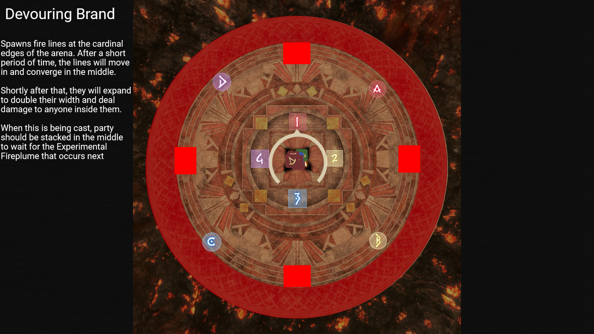
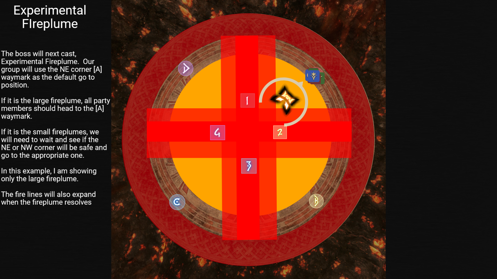
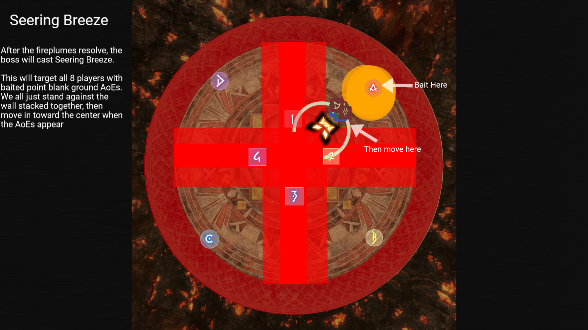
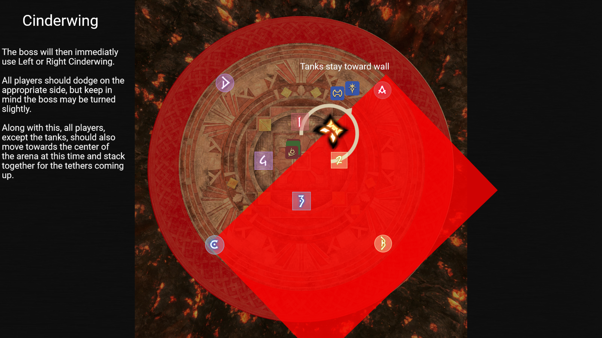
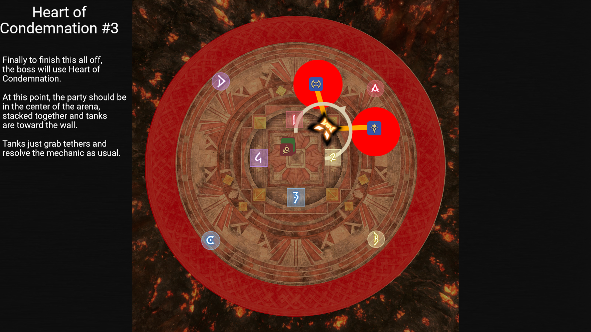

# Pandæmonium Asphodelos: The Third Circle (Savage)

## Devouring Brand + Seering Wind + Cinderwing + Heart of Condemnation

[Raid Plan](https://raidplan.io/plan/5VXsjB55Y7E69wZO)

I'm going to wrap all four of these mechanics into one document since the execution of one leads into the positioning and the execution of the next one.  Each section below will go over, in order, each of these mechanics

### Devouring Brand
Devouring brand will spawn fire lines in the cardinals of the edge of the arena. After a short period of time, the lines will start to move inward and meet at the center of the arena. Shortly after this, each line will then expand in width, dealing damage to any standing in the area they expand too.

**When this is being cast, party should be stacked in the the middel of the arena to wait for the Experimental Fireplume that occurs next.**

### Experimental Fireplume
Next, the boss will cast Experimental Fireplume. This works the same as it did before where it will either be the large baited one or the small ones. The party needs to wait in the middel to determine which it is.

If it is the **large fireplume** the party will then move to the NE corner of the arena at the A waymark.

If it si the **small fireplumes**, we will need to wait and see where the first one hits at.  Then we will move to the NW or NE corner of the arena based on where the first one hits.

Around the time that the fireplume(s) resolve, the devouring brand fire lines will expand in width, so be sure not to e right next to them.

### Seering Breeze
Next up is Seering Breeze. This mechanic will target all 8 players with baited ground AoEs.  We all just stack together at the wall, and when the AoEs appear, we move in toward the center of the arena, but be sure to avoid the fire lines from devouring brand.

### Left/Right Cinderwing
Next is Left or Right Cinderwing. Handle this as before, dodging either on the left or the right side of the boss.  **However, tanks should stay towards the edge of the arena and all other party members should move toward the center of the arena.**  This is to setup for the next mechanic.

### Heart of Condimnation #3
Finally, this mechanic rondo is finished off with Heart of Condimnation #3.  The party at this point should be stacked together at the center of the arena.  Tanks will then grab tethers and take them toward the wall to resolve the mechanic.
