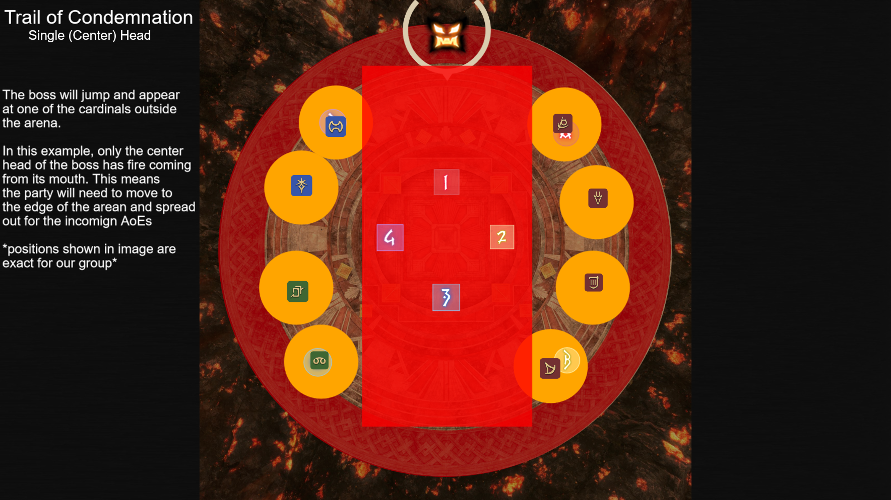
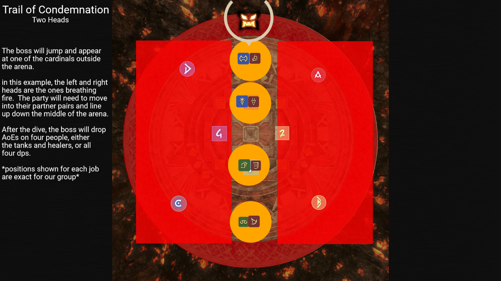

# Pandæmonium Asphodelos: The Third Circle (Savage)

## Trail of Condemnation

[Raid Plain](https://raidplan.io/plan/imsmrW8cntDOJhU4)

The boss will jump away and appear at one of the cardinals on the outside of the arena.  The boss will also hae either the center head breathing fire or the two outer heads breathing fire. How we handle this mechanic depends on the heads.

### Single (Center) Head
If the center head is the one breathing fire, this means the boss will do a 2/3 room wide cleave down the center of the arena.  After the boss does the dive, all party members will be hit with point blank AoEs, so they'll need to be spread out.

To handle this, we have preassigned positions for everyone to go on.  Tanks and Healers to the left wall and DPS to the right wall.  See the image below for where to stand.

### Two Heads
If the two outer heads are brething fire, this means the boss will do cleaves on to the left and right, leaving only the center lane safe.  After the dive, the boss will also drop four AoEs on either the tanks and healers or all four dps. 

To handle this, the party will need to line up with their partners, in the order shown in the image below.

