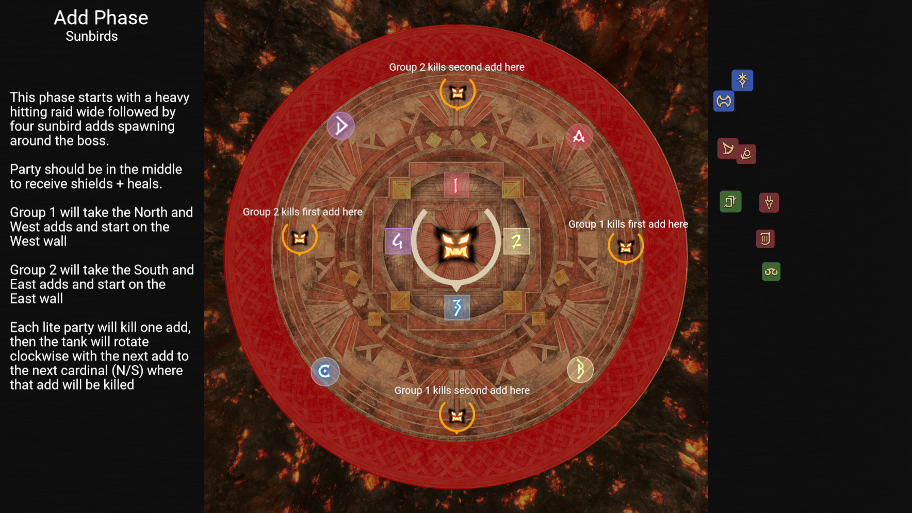
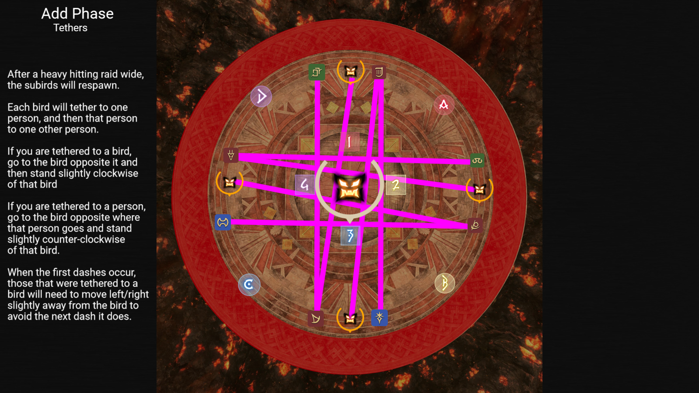

# Pandæmonium Asphodelos: The Third Circle (Savage)

## Adds Phase
The adds phase happens in three parts. Each part is broken down into the sections below

## Sunbird Spawns
The add phase will begin with a heavy hitting raid wide; shield and heal. This will also spawn four sunbird adds around the boss.  These adds must be killed in a way that leaves adequate space between them.  To handle, this, we'll split into our lite parties.

- Group 1 will grab the North and West adds and take them to the West wall
- Group 2 will grab the South and East adds and take them to the East wall.

First each group will kill one of the sunbirds, then the tank for their group will rotate clockwise to the next cardinal, where the second bird for that group will be killed.

This should leave it with one sunbird dead in the North, East, South, and West walls of the room. 

## Sunbird Revival + Tethers
Next the boss will perform another heavy hitting raid wide; shield and heal. This will revive each of the sunbirds.  While each bird is reviving, it will telegraph a very large circle marker under it. This does not deal any damage to the party, however if any one bird's circle overlaps another bird, then they will get a buff when revived. This is why we kill them spaced out. 

Once the birds have revived, each bird will then tether to a random party member, and that party member will tether to another party member.  The birds will then dash at the party member they are tethered to, and then dash a second time to the next party member in the tether chain.

The following are the steps, in order, to handle the tethers

1. Before tethers spawn, be in the middle to receive heals + shields
2. Next, if you are tethered to a bird, take your tether across the arena to the opposite bird, then move slightly **clockwise** from that bird.
3. For those that are tethered to a party member, take your tether across the arena to the bird opposite the party member you are tethered too, then move slightly **couter-clockwise** from that bird.

If everyone positions correctly, the tethers should look something like this image below.

## Kill Sunbirds
After the tethers have resolved, each lite party group will then need to kill their birds once again one bird per cardinal.  See the first image above for kill locations.